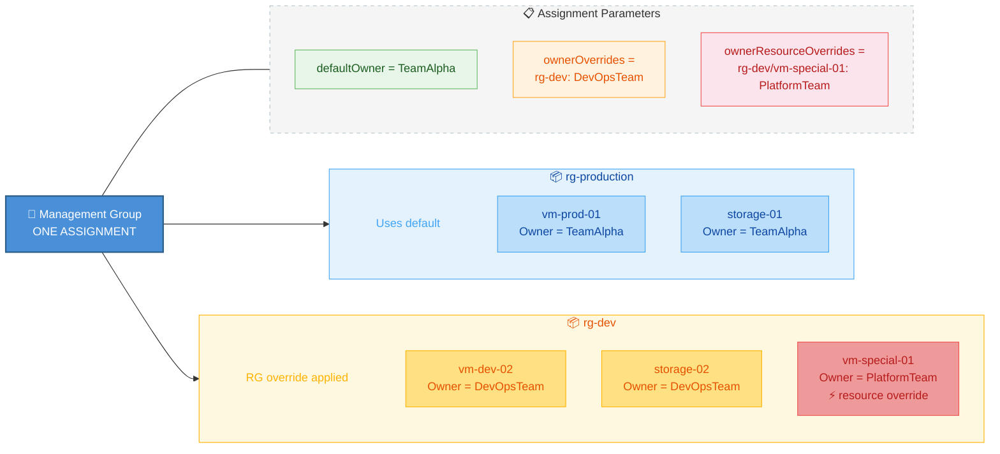

# Azure Hardened Tag Enforcement — Single Assignment with Per-RG and Per-Resource Overrides

Enforces three mandatory tags (**Owner**, **CostCode**, **BusinessUnit**) on all resources under a management group. Each tag supports three resolution levels — a **default value**, **per-resource-group overrides**, and **per-resource overrides** — all within **one policy assignment**.

## How it works

Each policy uses nested ARM `if(contains(...))` expressions with three-tier priority:

```
if resourceGroup/resourceName is a key in the resource override map
  → use the resource override value
else if resourceGroup is a key in the RG override map
  → use the RG override value
else
  → use the default value
```

Tags are **strictly enforced** — if someone changes or removes a tag, the policy corrects it on the next evaluation.



## Repository structure

```
Azure_Hardened_Tag_Enforcement/
├── policies/
│   ├── enforce-tag-owner.json         # Policy definition — Owner
│   ├── enforce-tag-costcode.json      # Policy definition — CostCode
│   ├── enforce-tag-businessunit.json   # Policy definition — BusinessUnit
│   └── initiative.json                # Initiative bundling all three
├── scripts/
│   ├── Stage_Test_Infrastructure.ps1  # Create MG, subscription, RGs, resources
│   ├── Deploy_Tag_Policies.ps1        # Deploy definitions, initiative, assignment
│   ├── Validate_Tag_Enforcement.ps1   # Scan resources and report compliance
│   ├── Modify_Tags.ps1               # Apply non-compliant tags to test policy
│   └── Destroy_Test_Infrastructure.ps1# Tear down all test resources
├── .env                               # Configuration for all scripts
├── assignment-parameters.example.json # Example parameter values
├── TestValidationReadme.md            # End-to-end test & validation guide
└── README.md
```

## Automated test & validation

A full suite of PowerShell scripts is included to provision infrastructure, deploy the policies, simulate tag tampering, and validate that the policies auto-correct. See **[TestValidationReadme.md](TestValidationReadme.md)** for the complete walkthrough, script parameters, and configuration options.

## Import into the Azure Portal

### Step 1 — Create the 3 policy definitions

For each file (`enforce-tag-owner.json`, `enforce-tag-costcode.json`, `enforce-tag-businessunit.json`):

1. **Azure Portal > Policy > Definitions > + Policy definition**
2. **Definition location**: your management group
3. **Name**: match the filename (e.g. `enforce-tag-owner`)
4. **Category**: `Tags`
5. Paste the `policyRule` and `parameters` content
6. Save

### Step 2 — Create the initiative

1. **Policy > Definitions > + Initiative definition**
2. **Definition location**: same management group
3. Add the 3 policies from Step 1
4. In `initiative.json`, replace **`<MG_ID>`** with your management group ID
5. Save

### Step 3 — Assign the initiative

1. **Policy > Assignments > Assign initiative**
2. **Scope**: your management group
3. Set parameters:

   | Parameter | Example value |
   |---|---|
   | Default Owner | `TeamAlpha` |
   | Owner RG overrides | `{"rg-dev": "DevOpsTeam", "rg-shared": "SecurityTeam"}` |
   | Owner resource overrides | `{"rg-dev/vm-special-01": "PlatformTeam"}` |
   | Default CostCode | `CC-1000` |
   | CostCode RG overrides | `{"rg-dev": "CC-2000-DEV", "rg-staging": "CC-3000-STG"}` |
   | CostCode resource overrides | `{"rg-prod/vm-billing-01": "CC-9000-BILLING"}` |
   | Default BusinessUnit | `Engineering` |
   | BusinessUnit RG overrides | `{"rg-finance": "Finance", "rg-marketing": "Marketing"}` |
   | BusinessUnit resource overrides | `{"rg-prod/vm-billing-01": "Finance"}` |

4. **Remediation** tab: check **Create a remediation task**
5. Save

See `assignment-parameters.example.json` for a complete example.

### Adding or changing an override

Just **edit the assignment parameters** — no new policies or assignments needed:

1. **Policy > Assignments** > click the assignment
2. **Edit assignment > Parameters**
3. Add, change, or remove entries in the override Object
4. Save
5. Run a remediation task to apply changes to existing resources

## How the policy rule works

The policy condition checks four cases (using Owner as an example):

1. **Tag is missing** → fire (add it)
2. **Resource key (`rgName/resourceName`) is in the resource override map AND tag differs** → fire (correct it)
3. **Resource key is NOT in resource map, RG is in the RG override map AND tag differs** → fire (correct it)
4. **Neither map has an entry AND tag differs from the default** → fire (correct it)

The modify operation resolves the correct value using nested `if()`:

```json
"value": "[if(
  contains(parameters('tagValuesByResource'), concat(resourceGroup().name, '/', field('name'))),
  parameters('tagValuesByResource')[concat(resourceGroup().name, '/', field('name'))],
  if(
    contains(parameters('tagValuesByResourceGroup'), resourceGroup().name),
    parameters('tagValuesByResourceGroup')[resourceGroup().name],
    parameters('defaultTagValue')
  )
)]"
```

### Override key format

| Level | Key format | Example |
|---|---|---|
| Resource group | `<rgName>` | `"rg-dev"` |
| Specific resource | `<rgName>/<resourceName>` | `"rg-dev/vm-special-01"` |

The resource name is the ARM `field('name')` value — the short name of the resource, not the full resource ID.

## Scope

- **Policy mode**: `Indexed` — applies to all resources inside resource groups
- **Resource groups themselves** are not tagged by this policy (they are subscription-level resources and `resourceGroup()` is not available when evaluating an RG). If you need to enforce tags on RGs too, create a separate simple `mode: All` policy scoped to `Microsoft.Resources/subscriptions/resourceGroups`

## Default tag values

| Tag | Default |
|---|---|
| Owner | `TeamAlpha` |
| CostCode | `CC-1000` |
| BusinessUnit | `Engineering` |

## Remediating existing resources

After creating or updating the assignment, run a remediation task:

1. **Policy > Remediation > + Remediation task**
2. Select the assignment
3. Choose the policies to remediate
4. Submit

## Cleanup

```bash
MG=hardened-tags-mg

# Remove assignment
az policy assignment delete \
  --name <ASSIGNMENT_NAME> \
  --scope "/providers/Microsoft.Management/managementGroups/$MG"

# Remove initiative
az policy set-definition delete \
  --name tag-enforcement-initiative \
  --management-group $MG

# Remove definitions
for tag in owner costcode businessunit; do
  az policy definition delete --name "enforce-tag-${tag}" --management-group $MG
done
```
